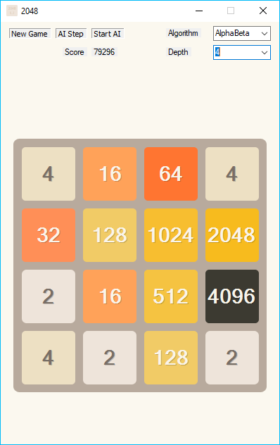

# 2048 Solver
A program written in C# that plays and solves the puzzle game [2048](https://en.wikipedia.org/wiki/2048_(video_game)) using AI techniques. In particular, it uses [Minimax](https://en.wikipedia.org/wiki/Minimax) with [Alpha-Beta Pruning](https://en.wikipedia.org/wiki/Alpha–beta_pruning). 

### Credits:
The graphics and basic game mechanics are created by Łukasz Jakowski.