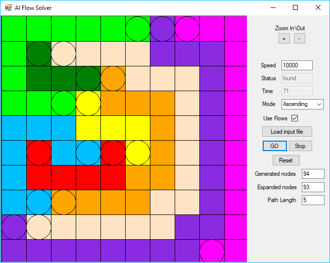
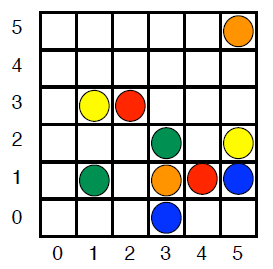

# AI Flow Solver
A program written in C# to solve the puzzle game [Flow Free](https://en.wikipedia.org/wiki/Flow_Free) using AI techniques. In particular, it uses [A*](https://en.wikipedia.org/wiki/A*_search_algorithm)'s best-first search on the task after representing it as a [constraint-satisfaction problem (CSP)](https://en.wikipedia.org/wiki/Constraint_satisfaction_problem). 



The program reads an input file representing the grid with the flows. The listing of a flow scenario in a file, where the first line gives the size of the grid and the number of colored flows, while quintuples representing the endpoints appear on the succeeding lines as `x1 y1 x2 y2`.

For example, the input file of this grid



looks like:

```
6 5
0 1 1 3 2
1 1 3 5 2
2 2 3 4 1
3 3 0 5 1
4 3 1 5 5
```
