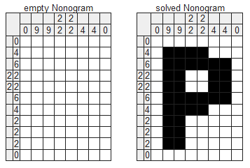
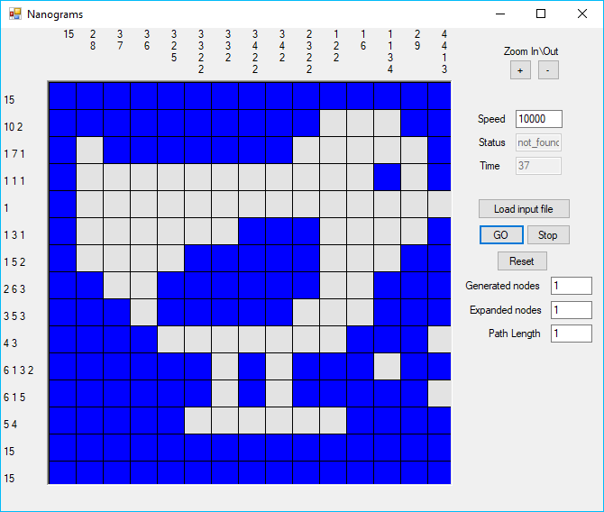
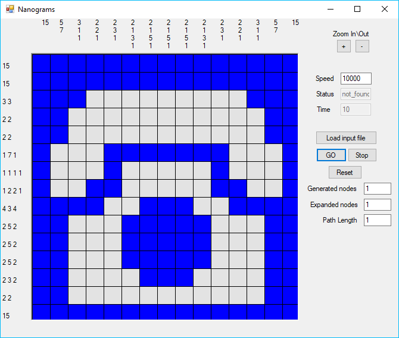

# Nanograms Puzzle Solver
[Nonograms](https://en.wikipedia.org/wiki/Nonogram), also known as Picross or Griddlers, are picture logic puzzles in which cells in a grid must be colored or left blank according to numbers at the side of the grid to reveal a hidden picture.

This program uses A-star and GAC (General Arc-Consistancy) algorithms to solve the puzzle and produce the picture.

 

## Download
To try the program, you can download the compiled executable from [here](https://github.com/ditek/AI/blob/master/Nonograms/AI-Nonograms/bin/AI_Nonograms.exe). You can try it out with the included [sample input files](https://github.com/ditek/AI/tree/master/Nonograms/input-files).